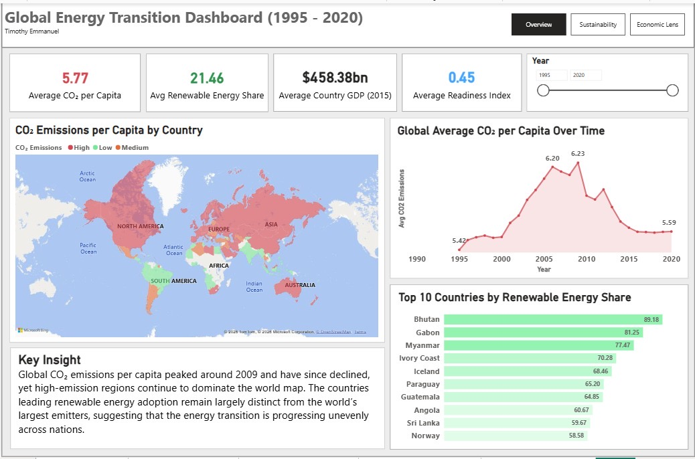
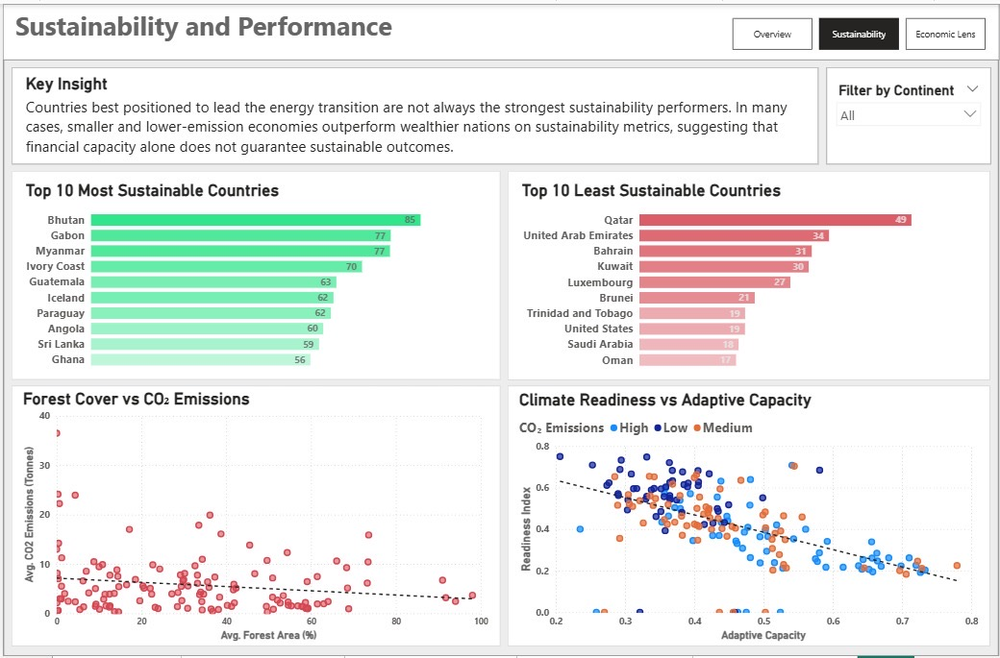
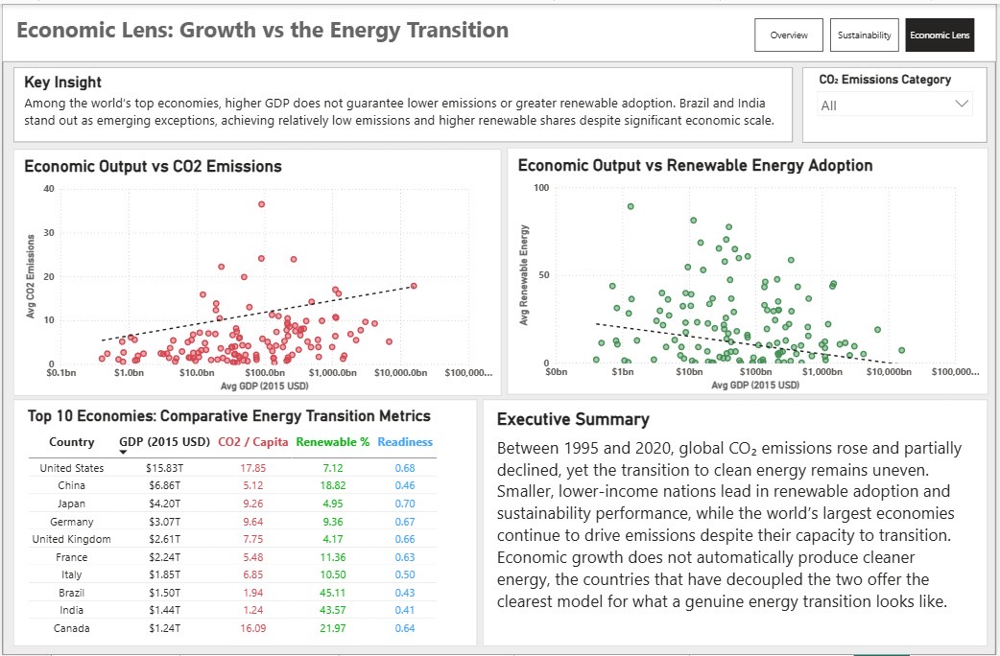
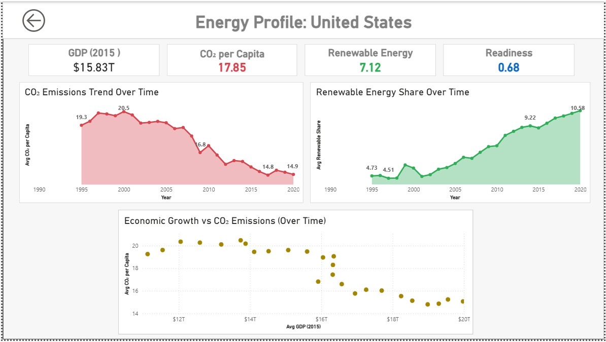
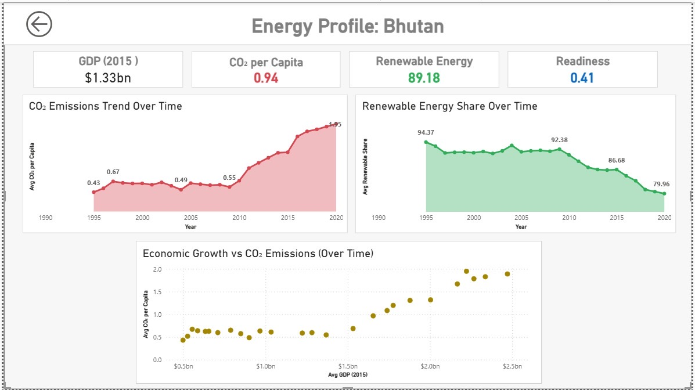

# Global Energy Transition Dashboard (1995 – 2020)

## Overview
This Power BI dashboard explores global trends in CO2 emissions, renewable energy adoption, economic growth, and climate readiness across 25 years of data. It was built as a portfolio project to demonstrate data modeling, DAX, and visual storytelling skills.

## Tools Used
- Power BI Desktop
- DAX
- Microsoft Bing Maps

## Dataset
This dashboard uses the Energy Economics Curated Dataset, a derivative dataset designed for examining how climate change, energy transitions, and development-linked indicators interact across environmental, economic, and socioeconomic dimensions.

The dataset is derived from the original Mendeley Data record titled "Energy Economics Data," contributed by Qiming Wang, accompanying the study "Climate Change, Energy Security and Agriculture: Evaluating Ecosystem Services, Renewable Energy Integration and Socioeconomic Impacts through a Global SWOT Analysis."

Metrics used include CO2 emissions per capita, renewable energy share, GDP (constant 2015 USD), average temperature, forest cover, climate readiness, and adaptive capacity — covering 1995 to 2020.

## Dashboard Structure
- **Page 1 — Overview:** Global CO2 emissions trends, world emission map, top renewable energy countries, and key KPIs across the full dataset period.
- **Page 2 — Sustainability and Performance:** Country-level sustainability rankings, forest cover analysis, and climate readiness vs adaptive capacity comparison by emissions.
- **Page 3 — Economic Lens:** Relationship between GDP, CO2 emissions, and renewable energy adoption among the world's largest economies, with a comparative metrics table and executive summary.
- **Drill-through Pages:** A dynamic country energy profile page accessible from any country in the dataset, displaying individual CO2 emission trends, renewable energy share over time, and economic growth vs emissions trajectory. The United States and Bhutan were sampled to illustrate contrasting energy transition pathways.

## Dashboard Preview

### Page 1 — Overview

### Page 2 — Sustainability and Performance

### Page 3 — Economic Lens

### Drill-through — United States

### Drill-through — Bhutan

## Key Findings
- Global CO2 emissions per capita peaked around 2009 and have since declined, though high-emission regions continue to dominate the world map.
- Smaller, lower-income nations such as Bhutan, Gabon, and Myanmar consistently lead in renewable energy share and sustainability performance, outperforming wealthier nations.
- Higher GDP does not guarantee lower emissions or greater renewable adoption. Brazil and India demonstrate that economic growth can be partially decoupled from carbon intensity.
- Country-level drill-through profiles reveal contrasting transition pathways. The United States shows emissions falling as GDP grows, while Bhutan maintains over 89% renewable energy share across 25 years despite rising emissions alongside economic development.
- Countries with the highest adaptive capacity tend to have lower climate readiness scores, suggesting that wealthy nations are preparing to cope with climate change rather than transition away from fossil fuels.

## Skills Demonstrated
- Data modeling and DAX measures
- Multi-page report architecture
- Slicer sync across pages
- Drill-through configuration
- Tooltip page design
- Scatter plot with trend lines
- Data storytelling through layered narrative structure
